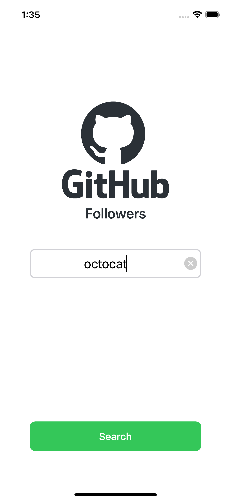
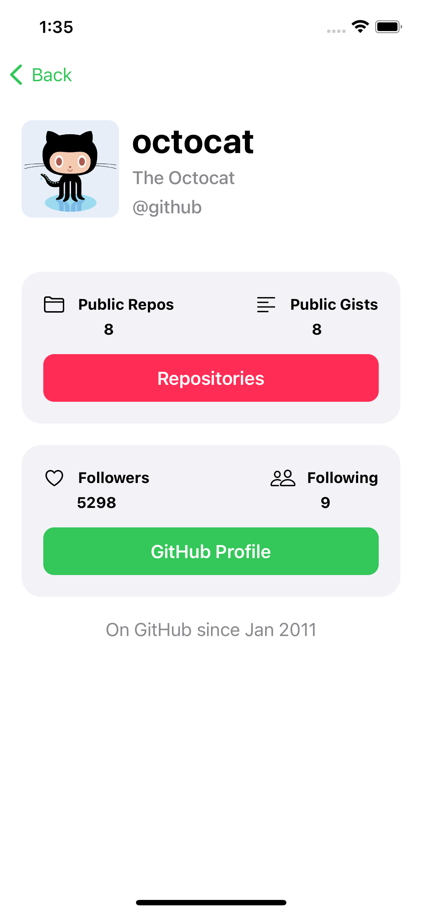
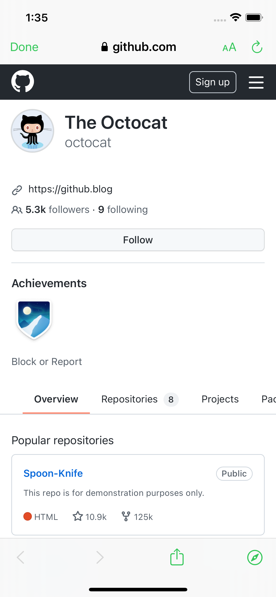
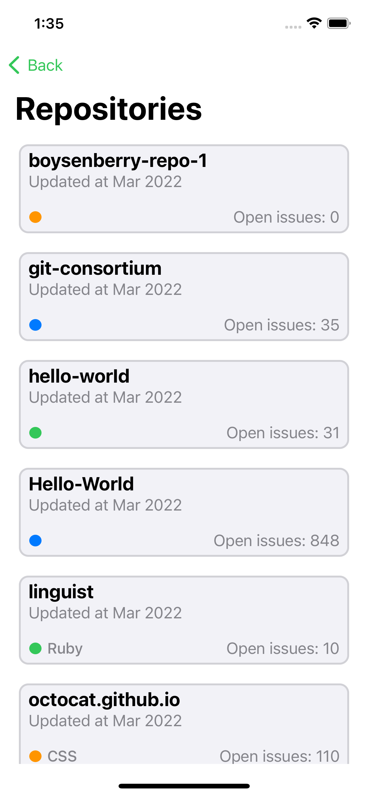
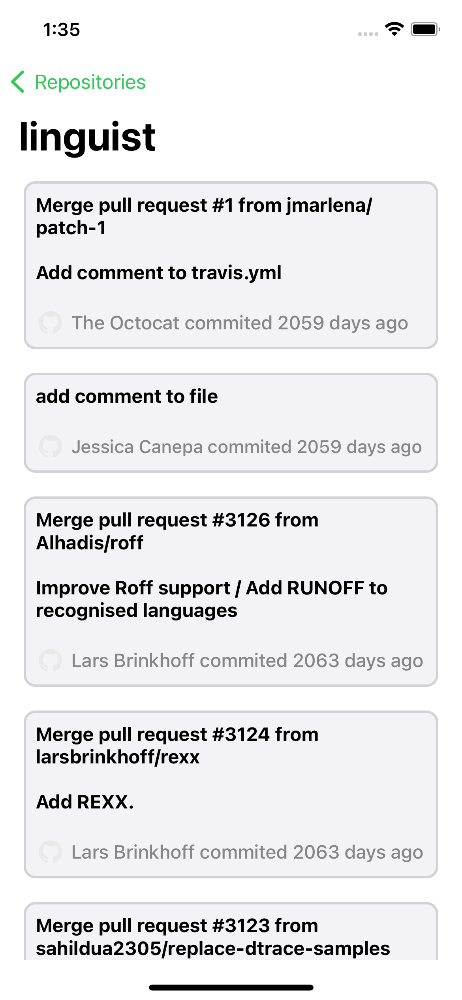
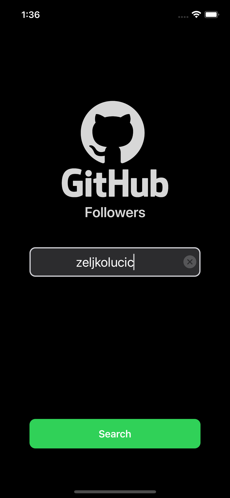
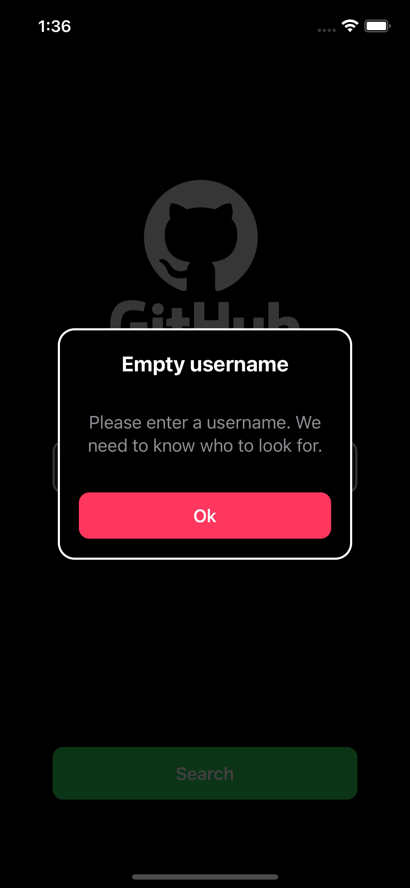
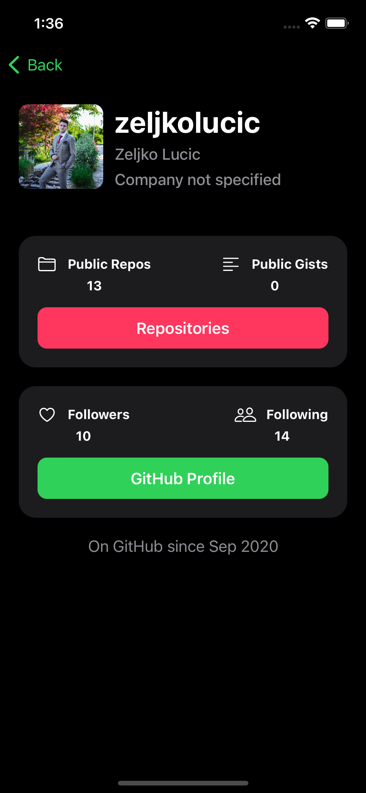
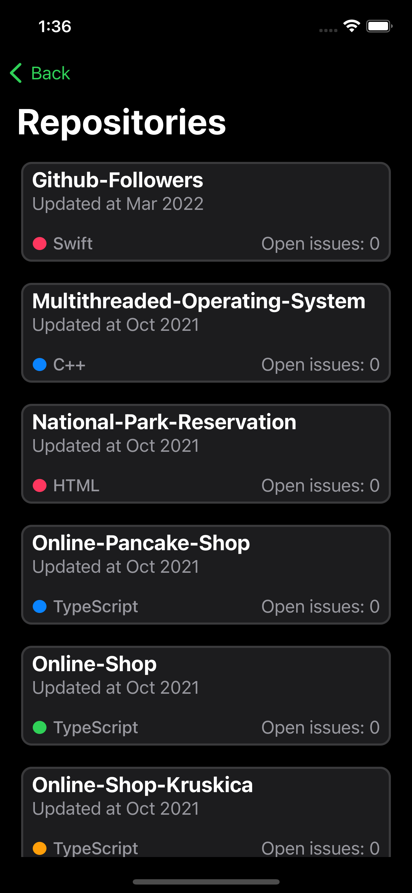
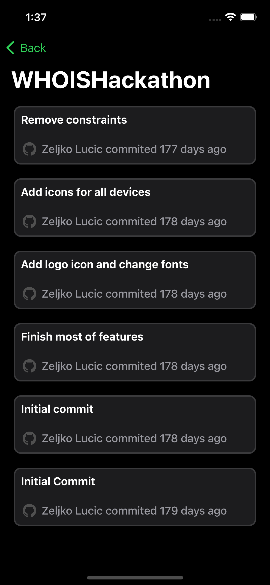

#GitHub-User

GitHub-User is an iOS native application, written in Swift programming language. This project is an interview take home project. The architecture design pattern
used in this application is MVC (Model-View-Controller), with the use of SOLID principles.

The main functionality of this app is to search for GitHub users, show basic information about those users, their repositories and commits for those repositories.

The first screen to show up is the search screen, where you can type in the GitHub user who you want to search for, and by pressing the "Search" button
the HTTP request to the GitHub API is being sent. If search field is left empty or a username which does not exist is being request the error is being 
handled properly and the custom alert is being shown.

Having fetched the data from GitHub API, it is being decoded using JSONDecoder and the decoded data is being shown in separated child view controllers
(each of sections is a separate child view controller). Avatar user image is being cached so that only the first time the image is actually fetched from
the HTTP request, and every other time is fetched from the cache, which optimizes the application performance.

Selecting the "GitHub Profile" button will present SafariViewController and the user's profile. 

However, selecting the "Repositories" button will take the user to the separate View Controller which displays the data about the requested 
user's repositories. If the user does not have any repositories, a proper empty state view is being shown. 

For each repository, list of all commits can be displayed. Information which is being presented for each commit includes commit message, user avatar image
and name along the message which refers to the time period (number of days from the current date) when this change was commited.

This application also supports both light and dark mode.

